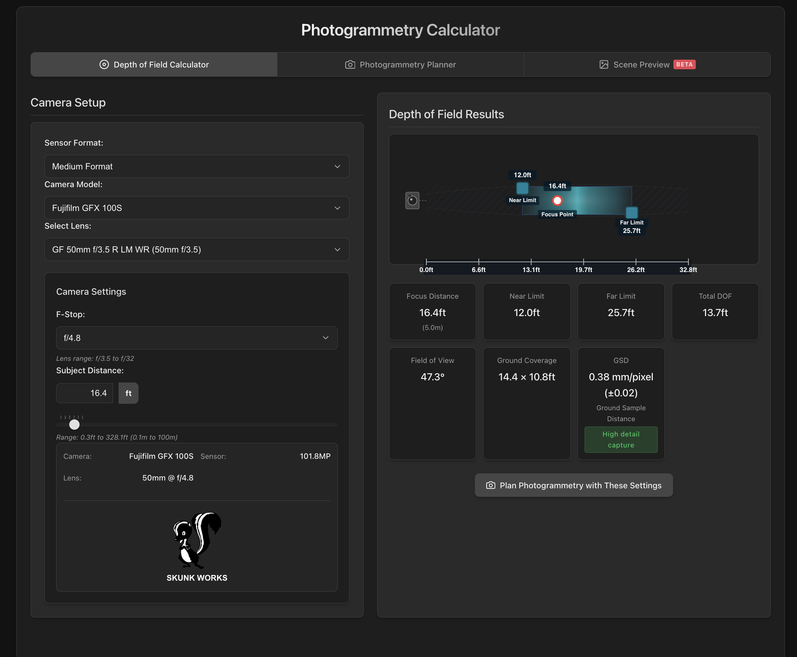

# Depth of Field (DOF) Calculator

A comprehensive tool for photographers and photogrammetrists to calculate and visualize depth of field for various camera and lens combinations.



## Features

- **Precise DOF Calculations**: Calculate hyperfocal distance, near limit, far limit, and total depth of field
- **Interactive Visualization**: Visual representation of depth of field with distance scale
- **Multiple Sensor Formats**: Support for various sensor sizes including Large Format, Medium Format, Full Frame, and APS-C
- **Unit Conversion**: Seamlessly switch between metric (meters) and imperial (feet) units
- **Ground Coverage Calculation**: Determine the width and height of the area covered by your camera at a specific distance
- **Ground Sample Distance (GSD)**: Calculate the pixel resolution on the ground for photogrammetry applications
- **Responsive Design**: Works on desktop and mobile devices
- **3D Visualization**: Visualize the camera frustum
- **Import 3D Models**: Import and view 3D models in OBJ and PLY formats
- **Import LiDAR Point Clouds**: Import and view LiDAR point clouds
- **Selection and Measurement Tools**: Use selection and measurement tools for precise measurements
- **Mission Planning Capabilities**: Plan drone missions with the application

## Requirements

- Node.js 18.x or higher
- npm 9.x or higher

## Installation

1. Clone this repository:
   ```bash
   git clone https://github.com/cdav1990/Photogrammetry_DOF.git
   cd Photogrammetry_DOF
   ```

2. Install dependencies:
   ```bash
   npm install
   ```

3. Start the development server:
   ```bash
   npm run dev
   ```

4. Open your browser and navigate to the URL shown in your terminal (typically http://localhost:5173 or similar)

## Usage

1. **Select Camera Format**: Choose your camera's sensor size from the dropdown menu
2. **Set Focal Length**: Enter the focal length of your lens in millimeters
3. **Set Aperture**: Select the f-stop value for your lens
4. **Adjust Focus Distance**: Use the slider or direct input to set your focus distance
5. **Toggle Units**: Switch between meters and feet using the toggle button
6. **View Results**: See the calculated DOF values and visualization

## Technical Details

### Core Calculations

The calculator implements the following key formulas:

- **Hyperfocal Distance**: The distance beyond which all objects appear acceptably sharp
- **Circle of Confusion**: The maximum blur spot diameter that will still be perceived as a point by the human eye
- **Near Limit**: The closest distance at which objects appear acceptably sharp
- **Far Limit**: The furthest distance at which objects appear acceptably sharp
- **Ground Sample Distance (GSD)**: The distance between pixel centers as measured on the ground

### Technology Stack

- **React**: Frontend UI library
- **Vite**: Build tool and development server
- **D3.js**: For data visualization
- **CSS**: Custom styling with responsive design

## Development

### Project Structure

```
dof-calculator/
├── public/            # Static assets
│   ├── assets/        # Application assets
│   │   ├── DOFCalculator.jsx    # Main calculator component
│   │   └── DOFVisualization.jsx # Visualization component
│   ├── data/          # Data files
│   │   └── cameraLensData.json  # Camera and lens data
│   ├── utils/         # Utility functions
│   │   └── dofCalculations.js   # Core DOF calculation functions
│   ├── App.jsx        # Main application component
│   ├── App.css        # Application styles
│   ├── index.css      # Global styles
│   └── main.jsx       # Application entry point
├── .gitignore         # Git ignore file
├── package.json       # Project dependencies and scripts
└── vite.config.js     # Vite configuration
```

### Building for Production

To build the application for production:

```bash
npm run build
```

The built files will be in the `dist` directory.

## Contributing

Contributions are welcome! Please feel free to submit a Pull Request.

1. Fork the repository
2. Create your feature branch (`git checkout -b feature/amazing-feature`)
3. Commit your changes (`git commit -m 'Add some amazing feature'`)
4. Push to the branch (`git push origin feature/amazing-feature`)
5. Open a Pull Request

## License

None

## Acknowledgments

- Formula references from photographic depth of field theory
- Inspiration from existing DOF calculators while adding unique features for photogrammetry

## LiDAR Point Cloud Support

This application supports large point clouds (up to 500 million points) using Potree. To use this feature:

1. Create a `public/potree-data` directory in your project
2. Convert your LiDAR data to Potree format using [Potree Converter](https://github.com/potree/PotreeConverter)
3. Place the converted data in the `public/potree-data` directory
4. Use the LiDAR Import button in the application to load your point clouds

### Converting LiDAR Data for Potree

```bash
# Example using PotreeConverter
PotreeConverter.exe C:/path/to/your/lidar.las -o C:/path/to/your/output-folder -p your_project_name
```

Then copy the output files to the `public/potree-data` directory in your project. 